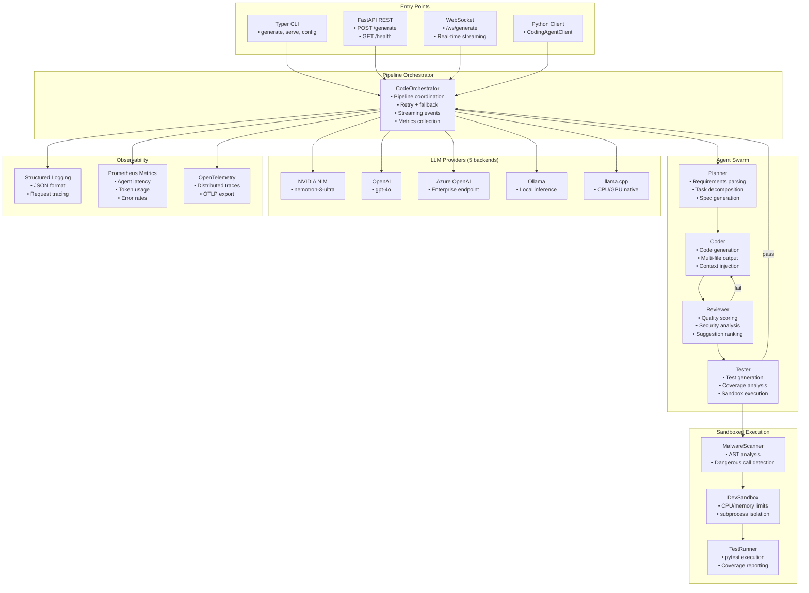

# Coding Agent Framework

[](https://python.org)
[](https://opensource.org/licenses/MIT)
[](https://github.com/astral-sh/ruff)
[](https://mypy-lang.org)
[](https://github.com/DavidEscotoDev/coding-agent-framework/actions/workflows/ci.yml)
[](https://github.com/DavidEscotoDev/coding-agent-framework/actions/workflows/ci.yml)

**TL;DR** — Production-grade multi-agent code generation pipeline: Planner → Coder → Reviewer → Tester with 5 LLM backends (NVIDIA NIM, OpenAI, Azure, Ollama, llama.cpp), sandboxed execution, and full observability (Prometheus + OpenTelemetry + structured logs). CLI, REST API, WebSocket streaming, and Python client included.

  <!-- TODO: Record CLI + WebSocket streaming demo GIF -->

## Why This Project

| Problem | Solution |
|---------|----------|
| LLMs hallucinate buggy code | **ReviewerAgent** scores quality, halts pipeline on failure |
| No safety for generated code | **MalwareScanner** (AST analysis) + **Sandboxed execution** (CPU/memory limits) |
| Vendor lock-in to one LLM | **Provider abstraction** with automatic fallback chain across 5 backends |
| No observability in AI pipelines | **Prometheus metrics** + **OpenTelemetry tracing** + **Structured JSON logging** |
| Hard to integrate into workflows | **REST API** + **WebSocket streaming** + **Python library** + **Typer CLI** |

## Tech Stack

| Category | Technology |
|----------|------------|
| Orchestration | FastAPI, Typer CLI |
| LLM Providers | NVIDIA NIM, OpenAI, Azure OpenAI, Ollama, llama.cpp |
| Safety | AST-based malware scanner, subprocess sandbox (resource limits) |
| Observability | structlog, Prometheus (6 instruments), OpenTelemetry (OTLP) |
| Testing | pytest, hypothesis, pytest-asyncio |

## Quick Start (≤5 commands)

```bash
git clone https://github.com/DavidEscotoDev/coding-agent-framework.git
cd coding-agent-framework
pip install -e .[dev]
cp .env.example .env  # Add NVIDIA_NIM_API_KEY, OPENAI_API_KEY, etc.
coding-agent generate "Create a REST API for a todo list with FastAPI"
```

## What I Learned

- **Multi-agent orchestration**: Pipeline coordination with retry/fallback logic, streaming events, quality gates that halt on review failure — patterns transferable to any LLM workflow
- **Provider-agnostic LLM abstraction**: Single interface with 5 concrete backends + automatic fallback chain — eliminates vendor lock-in, enables local-first development with Ollama/llama.cpp

---

## System Architecture



## Features

| Category | Capabilities |
|----------|--------------|
| **Multi-Agent Pipeline** | Planner → Coder → Reviewer → Tester with configurable quality gates |
| **LLM Provider Abstraction** | 5 backends with automatic fallback chain |
| **Safety & Security** | Static malware scanning (AST) + subprocess sandbox with resource limits |
| **Observability** | Structured JSON logging, Prometheus metrics (6 instruments), OpenTelemetry tracing |
| **API Interfaces** | REST, WebSocket streaming, Python library client, Typer CLI |
| **Configuration** | Pydantic Settings + YAML + environment variable overrides |

## Quick Start

```bash
# 1. Clone and install
git clone https://github.com/DavidEscotoDev/coding-agent-framework.git
cd coding-agent-framework
pip install -e .[dev]

# 2. Configure (add your API keys)
cp .env.example .env
# Edit .env with your NVIDIA_NIM_API_KEY, OPENAI_API_KEY, etc.

# 3. Generate code from CLI
coding-agent generate "Create a REST API for a todo list with FastAPI"

# 4. Or start the API server
coding-agent serve --host 0.0.0.0 --port 8000

# 5. Run tests
pytest tests/ -v
```

### Using the Python Client

```python
import asyncio
from coding_agent.api.client import CodingAgentClient

async def main():
    client = CodingAgentClient("http://localhost:8000")
    result = await client.generate("Build a binary search tree in Python with type hints")
    print(result.code)

asyncio.run(main())
```

### WebSocket Streaming

```python
import asyncio, json, websockets

async def stream():
    async with websockets.connect("ws://localhost:8000/ws/generate") as ws:
        await ws.send(json.dumps({"request": "Create a calculator class"}))
        async for msg in ws:
            data = json.loads(msg)
            print(f"[{data['stage']}] {data['message']}")

asyncio.run(stream())
```

## Configuration

All settings in `config.yaml` (environment variables in `.env` take precedence):

```yaml
llm:
  providers:
    - name: nvidia_nim
      type: nvidia_nim
      api_base: "https://integrate.api.nvidia.com/v1"
      api_key_env: "NVIDIA_NIM_API_KEY"
      models: ["nvidia/nemotron-3-ultra"]
      priority: 1
  fallback_chain: ["nvidia_nim", "openai", "azure_openai", "ollama", "llama_cpp"]

agents:
  planner: {temperature: 0.2, max_tokens: 2000}
  coder:   {temperature: 0.3, max_tokens: 4000}
  reviewer: {temperature: 0.1, max_tokens: 3000, quality_threshold: 70}
  tester:  {temperature: 0.2, max_tokens: 3000, coverage_threshold: 80}

sandbox:
  cpu_timeout_seconds: 10
  memory_limit_mb: 512

orchestrator:
  halt_on_review_failure: true
  max_retries: 2
```

## Project Structure

```
src/coding_agent/
├── config.py           # Pydantic Settings + YAML + env overrides
├── schemas.py          # Pydantic v2 data models (requests, responses, metadata)
├── contracts.py        # ABC interfaces for agents, LLM providers, sandbox
├── orchestrator.py     # Pipeline orchestration with retries, metrics, streaming
├── agents/             # Planner, Coder, Reviewer, Tester (ABC + implementations)
├── llm/                # Provider abstraction + 5 concrete backends
├── sandbox/            # MalwareScanner, DevSandbox, TestRunner
├── api/                # FastAPI server, REST routes, WebSocket, Python client
├── cli/main.py         # Typer CLI (generate, serve, config)
├── observability/      # Logging, Prometheus metrics, OpenTelemetry tracing
└── prompts/loader.py   # Versioned prompt templates (v1.0.0)

tests/
├── unit/               # Config, malware scanner tests
└── integration/        # Full pipeline tests with mocked LLM

examples/
└── quickstart.py       # End-to-end programmatic usage
```

## Testing

```bash
# Unit tests
pytest tests/unit/ -v

# Integration tests (mocked LLM)
pytest tests/integration/ -v

# All tests with coverage
pytest tests/ --cov=src/coding_agent --cov-report=term-missing
```

**Current status**: 10 tests passing (7 unit + 3 integration)

## Development

```bash
# Install dev dependencies
pip install -e .[dev]

# Lint & format
ruff check . && ruff format .

# Type check
mypy src/coding_agent --ignore-missing-imports

# Run full CI locally
ruff check . && mypy src/coding_agent --ignore-missing-imports && pytest tests/ -v
```

## Observability

| Component | Implementation |
|-----------|----------------|
| **Logging** | structlog with JSON output, configurable levels |
| **Metrics** | Prometheus (pipeline latency, request counts, agent latency, review scores, active requests) |
| **Tracing** | OpenTelemetry with OTLP export (Jaeger, Zipkin compatible) |

Start metrics server:
```bash
python -c "from coding_agent.observability.metrics import start_metrics_server; start_metrics_server(9090)"
```

## Docker

```bash
# Build
docker build -t coding-agent -f docker/Dockerfile .

# Run with docker-compose (includes Ollama, Jaeger, Prometheus)
docker-compose -f docker/docker-compose.yml up
```

## Contributing

Contributions are welcome! Please read our [Contributing Guide](CONTRIBUTING.md) and [Code of Conduct](CODE_OF_CONDUCT.md).

1. Fork the repository
2. Create a feature branch (`git checkout -b feature/amazing-feature`)
3. Run tests and linting (`pytest && ruff check . && mypy src/coding_agent`)
4. Commit with conventional commits (`feat: add amazing feature`)
5. Push and open a Pull Request

## License

MIT License - see [LICENSE](LICENSE) for details.

## Acknowledgments

- **NVIDIA NIM** for high-performance inference.
- **FastAPI** for the async web framework.
- **Pydantic** for data validation.
- **OpenTelemetry** for distributed tracing.
- **Prometheus** for metrics collection.